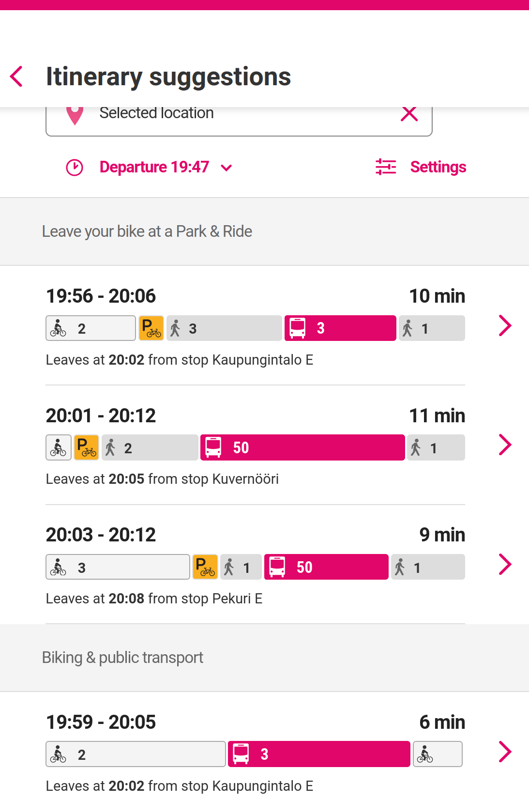

# Digitransit-UI

This is a fork of Digitransit-UI. The upstream repository is available [here](https://github.com/hsldevcom/digitransit-ui/) and contains further information.

Digitransit-UI is a mobile friendly user interface built to work with the Digitransit platform.

## Licensing

The source code of the Digitransit platform is dual-licensed under the EUPL v1.2 and AGPLv3 licenses. See [LICENSE-EUPL.txt](LICENSE-EUPL.txt) and [LICENSE-AGPL.txt](LICENSE-AGPL.txt).

## Fork specific notes

We focus on the "Bike and Public" and "Bike and Ride" transport modes:



### Required services

#### OpenTripPlanner, Background tiles and Geocoder

Digitransit-UI depends on these three services. Start them before Digitransit-UI from the BikeTripPlanner repository:

```shell
sudo docker compose up -d --wait api opentripplanner tileserver-gl
```

#### OpenTripPlanner

A test-UI is available at http://localhost:8080.

Test if the GraphQL API is enabled:

```shell
curl --request POST \
  --url http://localhost:8080/otp/routers/default/index/graphql \
  --header 'Content-Type: application/json' \
  --header 'OTPTimeout: 10000' \
  --data '{"query":"query stops {stops {gtfsId name}}","operationName":"stops"}'
```

```shell
curl --request POST \
  --url 'http://localhost:8080/otp/routers/default/index/graphql' \
  --header 'Content-Type: application/json' \
  --header 'OTPTimeout: 1000' \
  --data '{"query":"query agencies {agencies {name}}","operationName":"agencies"}'
```

### Development setup

#### Build and start

* https://github.com/HSLdevcom/digitransit-ui/blob/v3/docs/Installation.md#install-requirements

```shell
# Install and activate Node 12
sudo pacman -S --needed nvm
source /usr/share/nvm/init-nvm.sh
nvm install 12
node -v
```

* Webstorm > Settings > Languages & Frameworks > Node.js > Select Node 12 from `~/.nvm` subdirectory and do also select `yarn`.

See Dockerfile.

* PhantomJS development is suspended
  * OpenSSL 3 not supported
  * Therefore, we disable SSL by setting OPENSSL_CONF

```shell
yarn install && yarn setup
OPENSSL_CONF=/dev/null \
  yarn build
```

Optionally generate GraphQL schema, see GraphQL.md

* Maybe run this before yarn bild?

```shell
cd build

wget https://raw.githubusercontent.com/opentripplanner/OpenTripPlanner/dev-2.x/src/ext/resources/legacygraphqlapi/schema.graphqls -O otp-schema.graphqls

SCHEMA_SRC=otp-schema.graphqls \
  OTP_URL=http://localhost:8080/otp/routers/default/index/graphql \
  node generate-schema.js
```

Start Digitransit-UI, see Dockerfile.

```shell
CONFIG=btp \
  PORT=9999 \
  OTP_URL=http://localhost:8080/otp/routers/default/ \
  GEOCODING_BASE_URL=http://localhost:4000/v1 \
  yarn run dev
```

```shell
CONFIG=btp \
  PORT=9999 \
  OTP_URL=http://localhost:8080/otp/routers/default/ \
  GEOCODING_BASE_URL=http://localhost:4000/v1 \
  NODE_OPTS='--title=digitransit-ui' \
  yarn run start
```

Notes about startup:
* package.json > scripts > start => server/server.js

#### TODOs

* `npm rebuild node-sass`

* Report bug `TODO: missing parseInt`
* Pull request for commit `fix: use theme-independent variable` and `fix: theme colors get lost`
* Pull request for commit `docs: Update comment about menu position`
* Pull request for commit `feat: about section with HTML`
* Don't forget this commit: `revert: Remove dedupestops from Pelias options`
* Maybe pull request for commit `docs: Add documentation for agency.show config option`

#### Create a new configuration

* https://github.com/HSLdevcom/digitransit-ui/blob/0ab8bd780e1fe44b789ef32f46f240080d253f41/package.json#L48
* [docs/Themes.md](docs/Themes.md)

Copy your logo `btp-logo.svg` into the base directory. It will be copied into `app/configurations/images/...`. To create a new theme `btp`, run:

```shell
yarn add-theme btp '#e10669' btp-logo.svg
```

You can remove your logo from the base directory afterward.

For details, see `add-theme.js`.

#### Favicon

In your configuration, e.g. `config.btp.js`, you can configure a `.png` favicon:

```js
  favicon: './app/configurations/images/btp/favicon.png',
```

If your icon is saved as `.svg`, you can convert it with:

```shell
#convert -background white btp-logo.svg btp-logo.png
convert -background none btp-logo.svg btp-logo.png
```

To generate `_static/assets/icons-btp-*/`, run:

```shell
OPENSSL_CONF=/dev/null \
  yarn build
```
